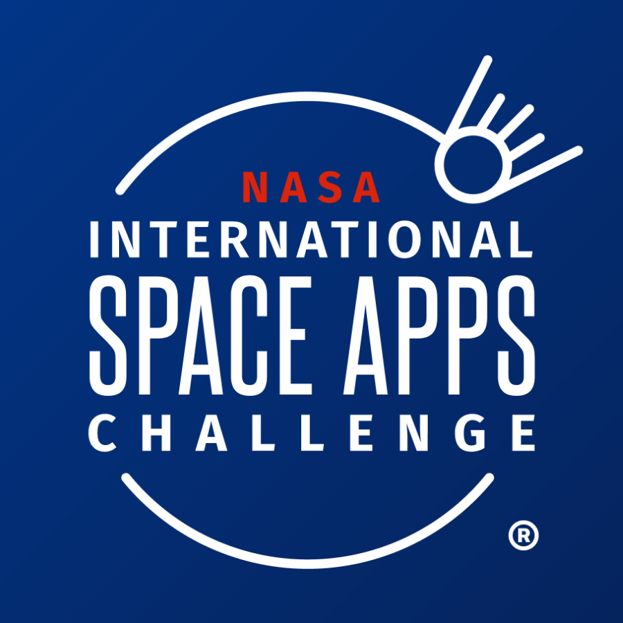

  <h1>
    
  </h1>

  

# ❓ About this Repository

  
 This repository contains all of the files and projects related to the subject<i> CPE 411 - Interactive Extended Reality. </i>

# 📋 Repository Contents

 This README.md File (Seatwork 1) 

# 💪 My Skills

### 💻 Programming & Development

  
  
  
  

### 🎨 Design & Prototyping

  
  
  

### 🏆 Notable Projects

# 📈 My Stats

  
  
  

# 🎶 My Spotify Recently 

  

# 👀 Profile Views

  

